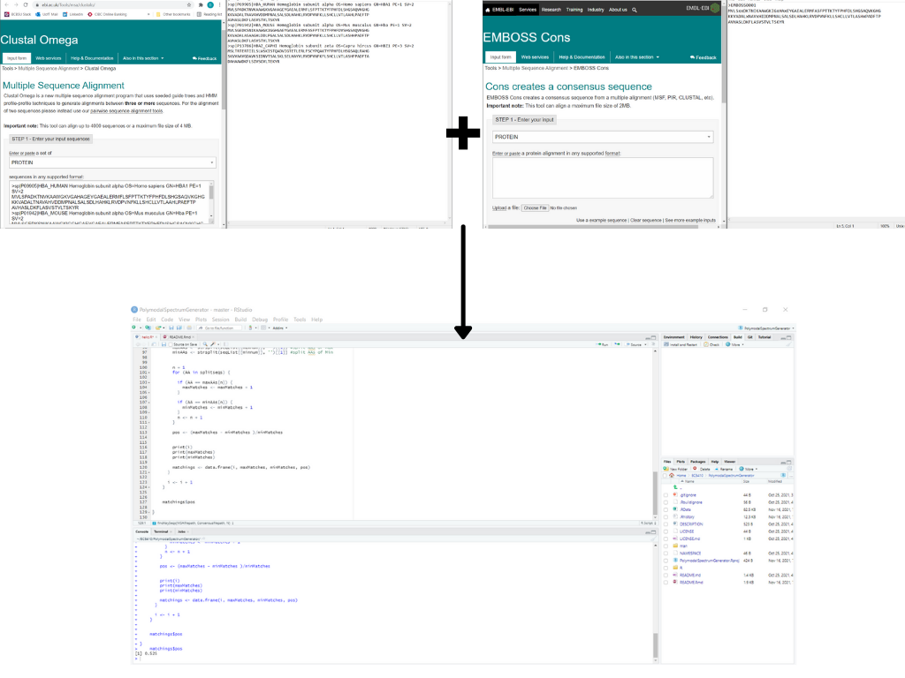

<!-- README.md is generated from README.Rmd. Please edit that file -->

# PolymodalSpectrumGenerator

<!-- badges: start -->
<!-- badges: end -->

The goal of PolymodalSpectrumGenerator is to easily generate key
groupings of variants of interests in protein sequences. By inputing a
set of sequences, and indicating the desired number of groupings, the
package will return the desired number of core variant groups, as well
as their relation to other variants in a spectrum.

Developped using: - R version 4.1.1 (2021-08-10) – “Kick Things” -
x86\_64-w64-mingw32/x64 (64-bit) Windows

## Installation

You can install the development version of PolymodalSpectrumGenerator
like so:

``` r
require("devtools")
devtools::install_github("dheydari0/PolymodalSpectrumGenerator", build_vignettes = TRUE)
library("PolymodalSpectrumGenerator")
```

## Overview

``` r
ls("package:PolymodalSpectrumGenerator")
```

To use this package:

1.  Generate an MSA of protein sequences of interest in .fasta format
    (Clustal Omega)
2.  Generate a consensus sequence using (EMBOSS Cons)
3.  Input your files, input your desired number of groupings, and run

<div style="text-align:center">

<div style="text-align:left">


## Contributions

This package made good use of the “msa” package, “An R Package for
Multiple Sequence Alignment” developed by Enrico Bonatesta, Christoph
Kainrath, and Ulrich Bodenhofer.

## References

Madeira F, Park YM, Lee J, et al. The EMBL-EBI search and sequence
analysis tools APIs in 2019. Nucleic Acids Research. 2019
Jul;47(W1):W636-W641. DOI: 10.1093/nar/gkz268. PMID: 30976793; PMCID:
PMC6602479.

U. Bodenhofer, E. Bonatesta, C. Horejs-Kainrath, and S. Hochreiter
(2015). msa: an ˇ R package for multiple sequence alignment.
Bioinformatics 31(24):3997–3999. DOI: bioinformatics/btv494.

## Acknowledgements

This package was developed as part of an assessment for 2021 BCB410H:
Applied Bioinfor-matics, University of Toronto, Toronto, CANADA.
