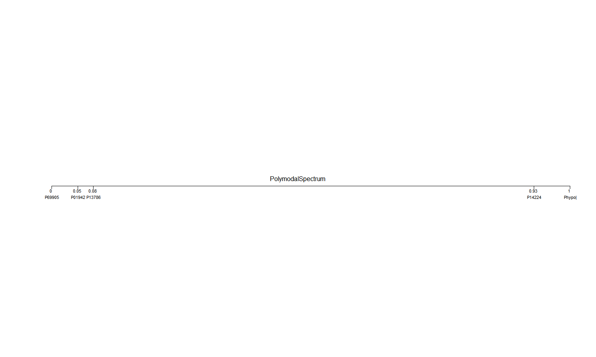

```{r, include = FALSE}
knitr::opts_chunk$set(
  collapse = TRUE,
  comment = "#>"
)
```


## Introduction

`PolymodalSpectrumGenerator` is a program for visualizing the key variants in a 
    given set of protein sequences. The program returns a plot of the n most
    significant variants in the set, positioned by their relative similarities.
    This program places the variants which match the consensus sequence best 
    and worst a 0 and 1 respectively.The variants are also assigned
    a strength, which is their number of matches with the best and worst, which is
    used to give priority to the varaints with the most matches.

To download **PolymodalSpectrumgenerator**, use the following commands:

```r
require("devtools")
devtools::install_github('dheydari0/PolymodalSpectrumGenerator', build_vignettes = TRUE)
library('PolymodalSpectrumGenerator')
```

To list all functions available in this package:

```r
ls("package:PolymodalSpectrumGenerator")
```
To view sample dataset in this package: 
```PolymodalSpectrumGenerator
data(package = "FastRPA")
```

To run the shiny app of this package: 
```r
PolymodalSpectrumGenerator::runPSG()
```

## Components

There is 1 main function in this package: 'generatePS()'.

'generatePS()': With a filepath to the multiple sequence alignment, and consensus sequence
  for a set of proteins, and a specified n, which is the number of desired
  variants to be shown, the program returns of plot of the n most significant
  varaints in the set.

The variant which matches the consensus sequence the best is position at the
  origin (0), and the variant which is the worst match with the consensus is at 1.
  The other n - 2 variants are positioned based off of the relative number of
  matches they have with the best and worst matches. The variants are also assigned
  a strength, which is their number of matches with the best and worst, which is
  used to give priority to the varaints with the most matches.

## Example

Precondition for user input: 
- The MSA must contain atleast 3 sequences
- N must be > 2

```r
MSAfilepath = "~/BCB410/PolymodalSpectrumGenerator/inst/extdata/aln-fasta.fasta"
Consensusfilepath = "~/BCB410/PolymodalSpectrumGenerator/inst/extdata/CONSENSUS.txt"
N = 5

generatePS(MSAfilepath, Consensusfilepath, N)
```

**Output:**

<div style="text-align:center">
<div style="text-align:left">

## Package References
<div style="text-align:left">
[Heydari, D. (2021) PolymodalSpectrumGenerator (Variant Visualizer Tool): an R package for visualizing variation in protein sequences.](https://github.com/dheydari0/PolymodalSpectrumGenerator)

<br>
<div style="text-align:left">
## Other References 
<div style="text-align:left">

Bodenhofer U, Bonatesta E, Horejs-Kainrath C, Hochreiter S (2015). “msa: an R package for multiple sequence alignment.” Bioinformatics, 31(24), 3997–3999. doi: 10.1093/bioinformatics/btv494.

Madeira F, Park YM, Lee J, et al. The EMBL-EBI search and sequence analysis tools APIs in 2019. Nucleic Acids Research. 2019 Jul;47(W1):W636-W641. DOI: 10.1093/nar/gkz268. PMID: 30976793; PMCID: PMC6602479.

Murrell, P. (2005). R Graphics. Chapman & Hall/CRC Press.

Pagès H, Aboyoun P, Gentleman R, DebRoy S (2021). Biostrings: Efficient manipulation of biological strings. R package version 2.62.0, https://bioconductor.org/packages/Biostrings.

R Core Team (2021). R: A language and environment for statistical computing. R Foundation for Statistical Computing, Vienna, Austria. URL https://www.R-project.org/.
 
Steipe B., ABC project (.utility 4.07) A Bioinformatics Course: Applied Bioinformatics http://steipe.biochemistry.utoronto.ca/abc/index.php/Bioinformatics_Main_Page

U. Bodenhofer, E. Bonatesta, C. Horejs-Kainrath, and S. Hochreiter (2015). msa: an ˇ
R package for multiple sequence alignment. Bioinformatics 31(24):3997–3999. DOI: bioinformatics/btv494.

Winston Chang, Joe Cheng, JJ Allaire, Carson Sievert, Barret Schloerke, Yihui Xie, Jeff Allen, Jonathan McPherson, Alan Dipert and Barbara Borges (2021). shiny: Web Application Framework for R. R package version 1.7.1. https://CRAN.R-project.org/package=shiny
<br /> 

----
```{r}
sessionInfo()
```
